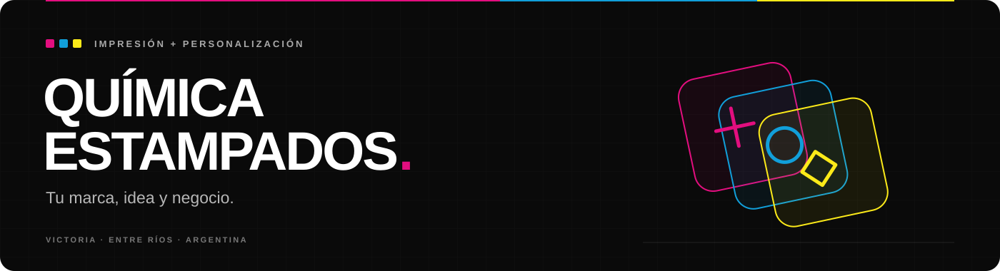

<p align="center">
  
</p>

<p align="center">
  <a href="https://github.com/enzodp123/quimica-estampados/actions/workflows/qa.yml"></a>
  <a href="https://astro.build"></a>
  <a href="package.json"></a>
  <a href="package.json"></a>
</p>

<p align="center">
  <strong>Impresión textil, productos personalizados y soluciones gráficas.</strong><br>
  Sitio institucional y catálogo de Química Estampados, Victoria, Entre Ríos, Argentina.
</p>

<p align="center">
  <a href="#funciones">Funciones</a> ·
  <a href="#desarrollo-local">Desarrollo local</a> ·
  <a href="#configuración">Configuración</a> ·
  <a href="#calidad">Calidad</a> ·
  <a href="docs/referencias-figma.md">Diseño en Figma</a>
</p>

---

## El proyecto

Una experiencia visual con fondo oscuro, acentos magenta, cian y amarillo, y el producto como protagonista. El sitio reúne la presentación de la marca, sus servicios, trabajos realizados y un catálogo de **18 fichas de producto**, con consultas directas por WhatsApp.

Construido con **Astro, TypeScript y CSS**, genera páginas estáticas y utiliza JavaScript para las interacciones. Los componentes, el contenido comercial y la lógica de precios se organizan por separado para facilitar el mantenimiento.

## Funciones

- **Catálogo de productos:** indumentaria, calcos, folletos, tarjetas personales y etiquetas, con galerías, opciones y guías de talles según el producto.
- **Precios por selección:** importes según cantidad y variante, total del pack y estado «Consultar» cuando no existe una tarifa definida.
- **Galería de trabajos:** categorías de textil, calcos, papelería, gran formato y corpóreos, con imágenes ampliables.
- **Carruseles y recomendaciones:** productos destacados y relacionados, con controles de navegación y desplazamiento táctil.
- **Contacto:** consultas precompletadas por WhatsApp, formulario con endpoint HTTP opcional, email y mapa de ubicación.
- **Diseño adaptable:** navegación móvil, preguntas frecuentes desplegables y estilos para distintos tamaños de pantalla.
- **Accesibilidad y metadatos:** enlace para saltar al contenido, controles por teclado, soporte de movimiento reducido, etiquetas Open Graph y datos estructurados `LocalBusiness`.

## Tecnologías

| Tecnología | Uso |
| --- | --- |
| Astro 7 | Componentes `.astro`, rutas y generación estática. |
| TypeScript 6 | Tipos del catálogo y lógica de las interacciones. |
| CSS | Variables de diseño, estilos globales y estilos de componentes. |
| Astro Icon + Lucide | Iconografía de la interfaz. |
| Fontsource | Fuentes Poppins, Montserrat y JetBrains Mono alojadas en el sitio. |
| Node Test Runner + HTML Validate | Pruebas y validación del resultado de producción. |
| GitHub Actions | Ejecución automática de QA en pushes y pull requests. |

## Desarrollo local

**Requisitos:** Node.js **22.12 o posterior** y npm. El repositorio incluye `package-lock.json` para instalar las versiones fijadas.

```bash
git clone https://github.com/enzodp123/quimica-estampados.git
cd quimica-estampados
npm ci
```

Copiá `.env.example` a `.env`:

```powershell
# Windows / PowerShell
Copy-Item .env.example .env
```

```bash
# macOS / Linux
cp .env.example .env
```

Iniciá el servidor en segundo plano, siguiendo las instrucciones de [AGENTS.md](AGENTS.md):

```bash
npx astro dev --background
```

El sitio se sirve por defecto en **http://localhost:4321**. Para administrar el servidor:

```bash
npx astro dev status
npx astro dev logs
npx astro dev stop
```

## Configuración

Los datos de marca, dirección, email y enlaces se centralizan en [`src/data/site.ts`](src/data/site.ts). Las siguientes variables permiten configurar las integraciones desde `.env`:

| Variable | Descripción |
| --- | --- |
| `PUBLIC_WHATSAPP_NUMBER` | Número internacional para `wa.me`, solo dígitos. |
| `PUBLIC_WHATSAPP_DISPLAY` | Teléfono con el formato que se muestra en la interfaz. |
| `PUBLIC_CONTACT_FORM_ENDPOINT` | Endpoint que recibe el formulario mediante `POST`. Si queda vacío, se abre WhatsApp con la consulta precompletada. |
| `PUBLIC_INSTAGRAM_URL` | URL del perfil de Instagram. |
| `PUBLIC_FACEBOOK_URL` | URL de la página de Facebook. |
| `PUBLIC_DEVELOPER_URL` | Enlace opcional del crédito de desarrollo `@binadevs`. |

Estas variables usan el prefijo `PUBLIC_`: no deben contener secretos. Al cambiar su configuración, generá nuevamente el build para actualizar el sitio publicado.

## Comandos

| Comando | Descripción |
| --- | --- |
| `npx astro dev --background` | Inicia el servidor de desarrollo en segundo plano. |
| `npm run check` | Comprueba los tipos de Astro y TypeScript. |
| `npm run build` | Genera `dist/` y elimina imágenes generadas sin referencias. |
| `npm run preview` | Sirve el build localmente para revisarlo. |
| `npm run validate:html` | Valida el HTML de `dist/`; requiere un build previo. |
| `npm test` | Ejecuta las pruebas de precios, carruseles y producción; requiere un build previo. |
| `npm run qa` | Ejecuta tipos, build, validación HTML y pruebas, en ese orden. |

## Estructura

```text
quimica-estampados/
├── .github/workflows/       QA automatizado
├── docs/                   Fuente de precios y referencias de diseño
├── public/                 Archivos públicos y guías de talles
├── scripts/                Posprocesado del build y herramientas de QA
├── src/
│   ├── assets/             Imágenes, logos e iconos
│   ├── components/
│   │   ├── layout/         Header, hero y footer
│   │   ├── product/        Fichas, precios, galerías y carruseles
│   │   ├── sections/       Secciones de la página principal
│   │   └── shared/         Elementos compartidos
│   ├── data/               Productos, precios y configuración de marca
│   ├── layouts/            Estructura HTML, metadatos y datos estructurados
│   ├── pages/              Inicio, productos/[slug] y página 404
│   ├── scripts/            Interacciones del navegador
│   └── styles/             Reset, variables y estilos globales
└── tests/                  Pruebas automatizadas
```

## Productos y precios

| Archivo | Responsabilidad |
| --- | --- |
| [`src/data/products.ts`](src/data/products.ts) | Fichas, slugs, imágenes, opciones y referencias Figma. |
| [`src/data/pricing.ts`](src/data/pricing.ts) | Tarifas, variantes, cantidades y cálculo de totales. |
| [`src/data/product-cards.ts`](src/data/product-cards.ts) | Productos destacados y recomendaciones. |
| [`docs/catalogo-precios-fuente.txt`](docs/catalogo-precios-fuente.txt) | Documento comercial de referencia para las tarifas. |

Las rutas `/productos/[slug]/` se generan desde `visibleProducts`, que publica únicamente fichas con imágenes. Para incorporar un producto, agregá sus assets y su definición con un `slug` único; si tiene tarifas, vinculá su registro de precios y la selección inicial.

Los precios conservan el formato de la fuente comercial. La interfaz muestra el total publicado del pack o lo calcula a partir del precio unitario y la cantidad, usando centavos enteros. Las combinaciones sin tarifa muestran **Consultar**. Las plantillas `PriceCatalog.astro` y `CatalogPricing.astro` se conservan como componentes, sin una página pública de catálogo general.

## Calidad

El control completo se ejecuta con:

```bash
npm run qa
```

La suite verifica las rutas generadas, metadatos, títulos únicos, enlaces internos, anclas, assets, integridad de precios y navegación de carruseles. También comprueba las **36 referencias de Figma** en el HTML y un presupuesto máximo de **35 MiB** para `dist/`.

El [workflow de GitHub Actions](.github/workflows/qa.yml) ejecuta este mismo control con Node.js 22 en cada push y pull request.

<details>
<summary><strong>QA visual y pruebas en navegador</strong></summary>

Las capturas y el reporte local se conservan en [`qa-reports/`](qa-reports/). El comando `npm run test:e2e` requiere un build previo y una configuración local adicional: el script actual importa Playwright desde `.tmp-visual/node_modules/` y utiliza Chrome instalado en `C:/Program Files/Google/Chrome/Application/chrome.exe`. No forma parte de `npm run qa` ni del workflow de CI.

</details>

## Build y publicación

```bash
npm run qa
npm run preview
```

El resultado publicable está en **`dist/`** y puede servirse desde un hosting estático. El posprocesado elimina imágenes raster generadas que no se utilizan, sin modificar los assets fuente.

Configurá el dominio definitivo mediante la opción `site` de [`astro.config.mjs`](astro.config.mjs) para generar las URLs canónicas. Antes de publicar, revisá los datos comerciales, precios y enlaces, probá el flujo de contacto y configurá la página 404 en el hosting.

## Diseño

La implementación toma como referencia el archivo [Cliente Estampados — Sitio Web](https://www.figma.com/design/jJAimgKVZatklPzSXvg8sh/Cliente-Estampados---Sitio-Web--copia-). El detalle de pantallas, estados e identificadores se conserva en [`docs/referencias-figma.md`](docs/referencias-figma.md).

---

<p align="center">
  <strong>Química Estampados</strong><br>
  Tu marca, idea y negocio.<br>
  <sub>Desarrollo: @binadevs</sub>
</p>
